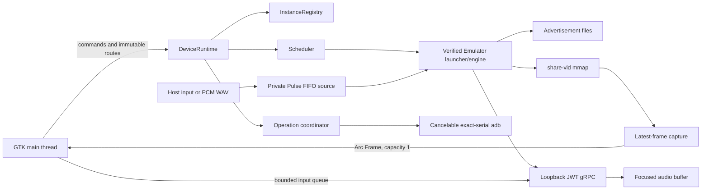

# liteavd architecture and implementation boundaries

**English** | [简体中文](../ARCHITECTURE.md)

This document describes the implemented architecture of liteavd 0.1.0. The
Chinese architecture, validated-facts, audit, and workplan documents remain the
canonical evidence record when a machine- or version-specific claim needs exact
numbers.

## 1. Scope and architectural goals

liteavd is a Linux/Wayland local Android multi-device workspace, not a general
Android SDK manager. Its primary architecture goals are:

1. low-latency embedded display and exact input routing for one official AVD;
2. multiple simultaneously visible devices with isolated focus and operations;
3. explainable ownership of ports, processes, memory, launch concurrency, and
   host-GPU slots;
4. safe adoption of existing SDK data plus a Java-free managed installation
   path;
5. a minimal-permission Flatpak distribution.

The current release is Linux x86_64 only. Remote Emulator, WebRTC, multiple
display surfaces, ARM hosts, Windows, and macOS are outside the initial scope.

## 2. Layered model

| Layer | Responsibility | Implemented boundary |
|---|---|---|
| Product/UI | Workspace, cards, focus, selection, progress, confirmation | GTK4/libadwaita, one-to-three-column responsive grid |
| Session control | Lifecycle, identity, recovery, health, exact routes | `DeviceRuntime`, `InstanceRegistry`, `WorkspaceRoute` |
| Scheduling | Ports, FIFO starts, memory and GPU reservations | even ports 5554–5586, explicit queue reasons and cancellation |
| Control/data plane | Input, screenshots, snapshots, audio, video | authenticated gRPC plus validated `-share-vid` mmap |
| SDK/AVD | Repository, licenses, cache, install, AVD files | Java-free managed path with transactional publication |
| Delivery | Settings, logs, CI, Flatpak, release | versioned private state, minimal sandbox, validated `v0.1.0` GitHub Flatpak prerelease |

Dependency direction is inward: UI projects core state, while `src/core/`
never references GTK types.

## 3. Process and data-flow overview



The GTK main thread owns GTK objects. Background workers hold pure `Send` data
or `glib::SendWeakRef` and return UI updates through `MainContext::invoke`.
Network, process, and operation futures use one shared long-lived Tokio
runtime; log I/O uses its blocking pool.

## 4. Session identity and lifecycle

An Emulator is identified by more than PID liveness. A running session binds:

- AVD name;
- console and adb ports;
- verified engine executable under the chosen SDK;
- process start identity;
- session ID and generation;
- managed/recovered/adopted origin;
- resource reservations;
- private JWT identity, optional capture, microphone endpoint, and logs.

The state model is:

```text
Stopped -> Queued -> Starting -> Booting -> Running
                                  |          |
                                  v          v
                                Error     Recovering
                                             |
Running/Recovering -> Stopping -> Stopped or Error
```

Generation tokens reject stale command completion. Advertisement rescans cannot
erase `Starting`, `Stopping`, or command errors. A `WorkspaceRoute` contains AVD
name, session ID, and generation; focus, selection, input, snapshots, audio,
microphone, APK/file operations, and stop all revalidate that exact route.

### Managed, recovered, and adopted

- Managed sessions own the launcher, verified engine, JWT, resources, logs, and
  optional capture/audio endpoints.
- A managed process may outlive the GUI. A later liteavd process acquires an
  exclusive private recovery lease and reconstructs a recovered session from
  advertisement and process facts.
- External instances without liteavd's private key remain adopted. The UI must
  not assume authenticated control, audio, microphone, or managed stop.

## 5. Scheduler and resource ownership

Console ports are atomically reserved from even values in `5554..=5586`; adb
uses the corresponding odd port. Exhaustion queues or rejects a request and
never falls back to an occupied port.

The scheduler uses FIFO order for concurrent-start slots, configured memory
budget, and DesktopHost GPU slots. A reservation starts before spawn and lives
with the session until exact stop or verified process disappearance. External
instances are reconciled into the same budget so they cannot be ignored by new
managed launches.

## 6. Emulator launch and stop

All managed control launches use `GrpcLaunchConfig`:

- explicit port;
- `-grpc-use-jwt`;
- per-session ES256 key and JWKS;
- minimum method allowlist;
- confirmation that the Emulator activated the JWK;
- loopback listener and client deadlines.

There is no unauthenticated `-grpc` fallback.

Launch validates duplicate AVD/port conflicts before spawn, keeps bounded
mode-0600 stdout/stderr logs, and distinguishes launcher from qemu engine.
Stop invalidates input/streams, verifies exact identity, sends SIGTERM, waits,
and escalates only against the same verified process. Ports, JWT directories,
Pulse resources, and shared video memory are released after engine exit.

## 7. `-share-vid` display path

The production display contract is a POSIX shared-memory object keyed by the
console port. Its header contains width, height, fps, frame counter, and
timestamp, followed by BGRA pixels.

The capture implementation validates:

- header and mapping length;
- dimension and multiplication overflow;
- configured dimension/byte limits;
- inode or size replacement;
- a stable frame counter before and after copying.

The producer is observed with latest-frame semantics. A capacity-one slot
overwrites unread old frames, so GTK work cannot grow with guest frame rate.
The UI creates `GdkMemoryTexture` from an `Arc<Frame>`-backed `glib::Bytes` and
uploads only while mapped.

Xvfb is used only for synthetic CI tests. HeadlessSwangle production capture
does not require an X server.

## 8. Input and latency

GTK touch, mouse, navigation key, and input-method events enter bounded queues.
Ordinary reliable events have a hard cap; pointer motion has capacity one and
is coalesced. Final motion is promoted before release so a drag cannot collapse
into a click. Cancel/detach/focus loss always sends a release.

Coordinates use the actual shared-video buffer and contain/letterbox geometry,
not screenshot orientation guesses.

`LatencyProbe` correlates input send, RPC completion, new frame counter,
validated copy, and GTK texture commit on one monotonic clock. It reports the
implemented endpoint (texture property commit), not display scanout or photons.

## 9. Cross-device operations and adb

An operation plan freezes a sorted set of exact routes for focused, selected,
or all-running scope. Confirmation is followed by a second authorization check;
any replaced target invalidates authorization. Execution reports every target
in deterministic order, and one failure does not hide later results.

The common adb runner provides:

- exact `emulator-<console-port>` serial;
- 64KiB tail per output stream plus total byte counts;
- explicit deadline and 50ms cancellation observation;
- bounded `ETXTBSY` spawn retry;
- kill and wait on cancel, timeout, or stale route.

APK operations support one APK or an explicit all-APK split set. Ordinary files
are streamed to `/sdcard/Download/liteavd/`, staged as unique `.part` files, and
published no-clobber. A stale route is never contacted for cleanup after port
reuse.

## 10. Guest output audio

The focused managed/recovered session opens authenticated `streamAudio` with
48kHz stereo S16LE and `MODE_REAL_TIME`. Packet/frame sizes are validated before
entering a fixed 120ms ring. The PulseAudio CPAL sink uses a fixed 480-frame
(10ms) callback; the callback performs no network I/O, blocking wait,
allocation, or GTK access.

Focus replacement cancels the old stream, clears queued audio, and applies
short fade-out/fade-in. Underflow emits silence; overflow drops the oldest
samples and records statistics. Audio failure is a substate and does not mark
the entire control plane disconnected.

## 11. Virtual microphone

Android Emulator 37.1.11 `injectAudio` is incompatible with the default
VirtioSnd guest and is excluded from the allowlist/client. The implemented path
is:

```text
CPAL host input or streaming PCM WAV
  -> bounded 48kHz mono S16 conversion
  -> per-session mode-0600 FIFO
  -> PipeWire-Pulse/PulseAudio module-pipe-source
  -> Emulator Pulse backend
```

Authenticated microphone-state RPC only enables or disables the exact private
source. Host input is explicit, non-persistent, focused-only, and globally
single-route. Focus, route, control revision, stop, and application exit cancel
the pump. PCM is never logged or persisted.

## 12. SDK repository, licenses, cache, and install

Managed mode parses Google repository XML and downloads selected Linux archives
with Range resume, verified `Content-Range`, streaming SHA-1/SHA-256, bounded
text responses, and a stable cache key. Cache quota accounting uses a root
lease and skips active entries.

License acceptance is keyed by license ID plus normalized text hash. Missing
text, rejection, dialog close, or write failure aborts installation.

Component writers use a cross-process `flock`. Zip extraction rejects traversal
and validates the final component structure. Installation stages beside the
target, syncs data, and uses backup/rollback. Runtime managed mode never calls
Java, `sdkmanager`, or `avdmanager`.

## 13. AVD files and settings

AVD creation uses versioned profiles/defaults, a per-name cross-process lock,
staging directories, fsync, and no-replace publication of the `.avd`/`.ini`
pair. Deletion refuses a verified running AVD.

Settings schema v1 has explicit v0 migration, a 1MiB input limit, visible
corruption fallback, mode-0600 atomic publication, and symlink rejection.
Workspace intent uses the same private atomic discipline.

## 14. GPU policies

- **HeadlessSwangle** is default, uses no host-GPU slot, and runs without
  `DISPLAY` or Xvfb.
- **DesktopHost** requires an inherited XWayland `DISPLAY`, uses `-gpu host`,
  consumes a host-GPU slot, and after authenticated startup verifies the engine
  executable, open `/dev/dri` descriptors, and absence of known software
  renderers. Failure stops the managed launch; no silent fallback occurs.

When the virtual microphone needs the normal Emulator binary, HeadlessSwangle
uses Qt offscreen while DesktopHost uses Qt xcb. The fixed SDK has no Qt Wayland
platform plugin.

## 15. Flatpak boundary

The manifest targets GNOME 50 and grants only:

- Wayland, explicit X11, and shared IPC;
- PulseAudio socket;
- DRI and KVM devices;
- network for Google downloads and localhost control sockets.

There is no broad filesystem permission. Managed SDK and AVD state lives below
the Flatpak-private XDG data directory. Host SDK adoption requires exact user
overrides. Chooser and drop operations receive document portal paths for exact
files.

The microphone FIFO uses the app-specific shared runtime directory because the
host Pulse daemon cannot see a FIFO inside the sandbox-private auth namespace;
type, UID, mode, owner PID, and session key are revalidated.

## 16. Verification strategy

Hermetic CI runs:

- Rust 1.88 core-only dependency leak check, tests, and strict Clippy;
- stable format, all-target tests, Xvfb synthetic smoke, and strict all-feature
  Clippy;
- desktop, AppStream, and Flatpak manifest validation.

Real KVM, SDK, GPU, audio, microphone, and long-soak tests remain explicit
ignored gates on a controlled host. They use isolated roots and exact cleanup.
The validated facts document records hardware, Emulator version, dates,
latency, resource peaks, and retained failures.

The public `v0.1.0` prerelease additionally passed the Ubuntu 24.04 tag
workflow, bundle installation and checksum verification, followed by an
independent local download, checksum, reinstall, and permission inspection.

## 17. Known architectural limitations

- The fixed Emulator 37.1.11 can crash under repeated Google Clock timer plus
  HeadlessSwangle audio-stream stress. Deterministic product audio passes; the
  historical failure remains documented until an Emulator upgrade is retested.
- Adopted sessions without liteavd private material are observable, not assumed
  controllable.
- Boot polling has not yet been migrated to the common adb runner.
- Operation history is not persisted and operations execute targets
  sequentially.
- Cache management UI, custom profile editing, multi-touch, multi-display, and
  compressed virtual-microphone formats are future work.
